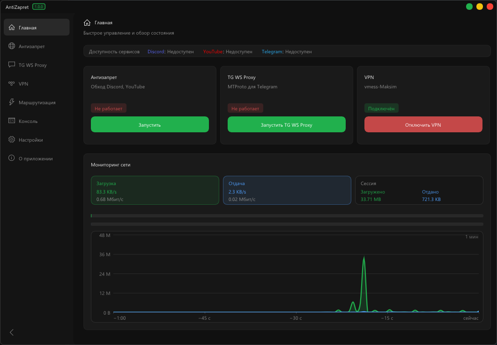
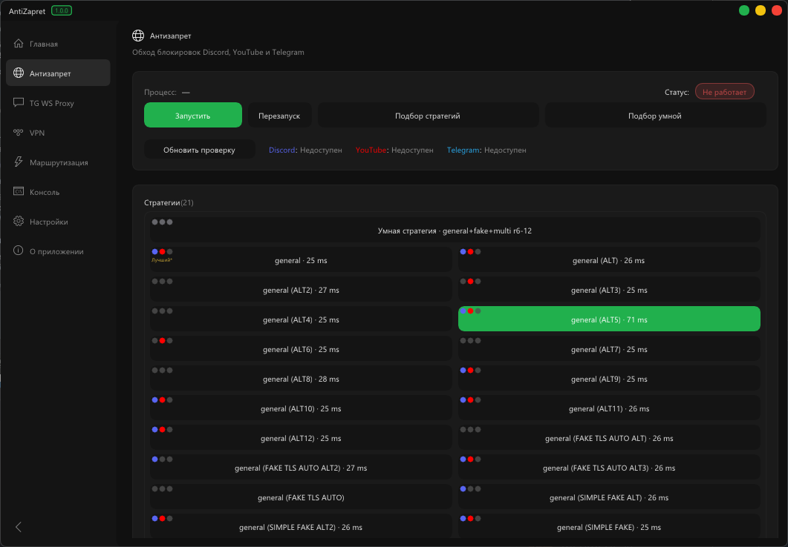
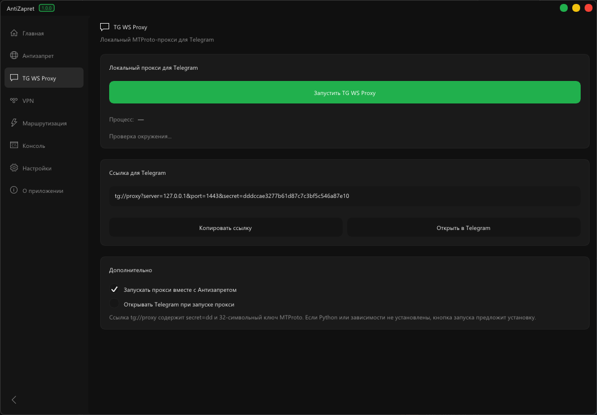
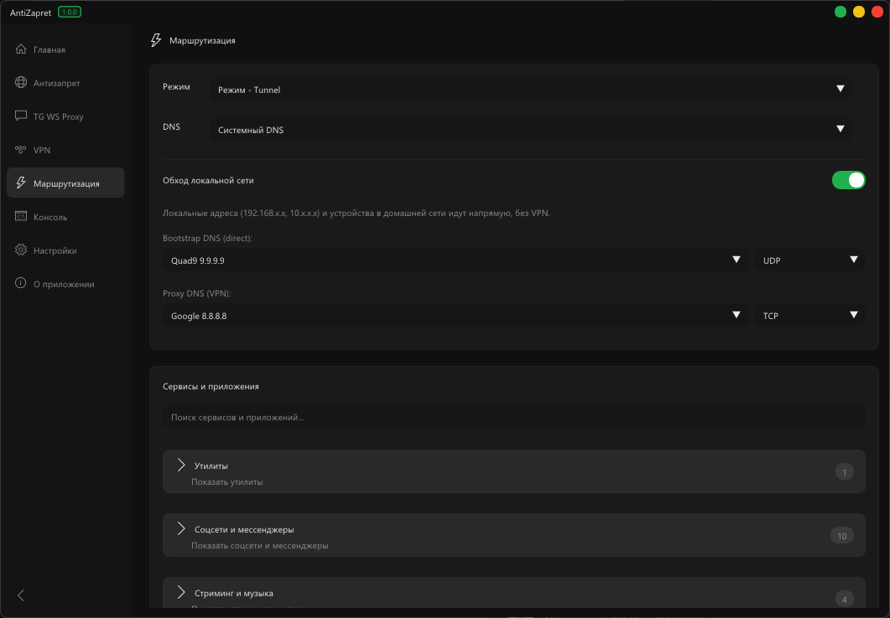
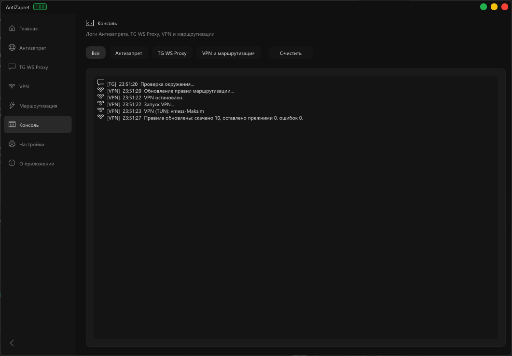
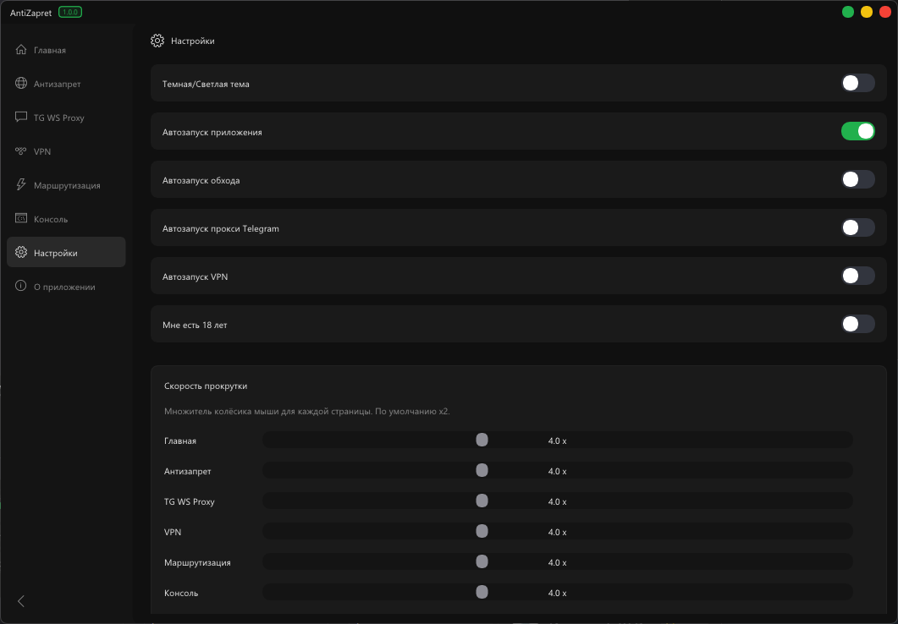
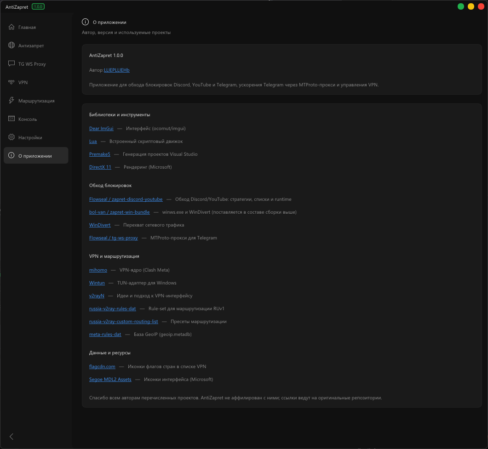

# AntiZapret

<p align="center">
  
</p>

**AntiZapret** — одно Windows-приложение, в котором собраны несколько разных сервисов для обхода блокировок и работы сети. Вместо кучи отдельных утилит — общий интерфейс, общий запуск и быстрый обзор состояния.

<details>
<summary>Ещё скриншоты</summary>

<br>

| Антизапрет | TG Fix |
|:---:|:---:|
|  |  |

| Маршрутизация | Консоль |
|:---:|:---:|
|  |  |

| Настройки | О приложении |
|:---:|:---:|
|  |  |

</details>

## Что внутри

Тезисно — что объединено в одном клиенте:

- **Антизапрет (zapret)** — обход блокировок Discord, YouTube и связанных сервисов через стратегии и WinDivert
- **TG WS Proxy** — MTProto-прокси для ускорения и стабильности Telegram
- **VPN (mihomo)** — подключение к своим серверам (vmess / trojan и др.) с удобным списком узлов
- **Маршрутизация** — правила, куда какой трафик идёт (обход / VPN / напрямую)
- **Главная** — статус сервисов, быстрый старт/стоп и мониторинг сети
- **Консоль и настройки** — логи, автозапуск, тема интерфейса

Всё это собрано **для удобства**: один установщик-пакет, один UI, меньше ручной возни с отдельными программами.

## Скачать

Последний релиз: **[v1.0.0](https://github.com/multimaks2/AntiZapret/releases/tag/v1.0.0)**  
Архив: `AntiZapret-1.0.0-win32.zip` — распаковать и запустить `AntiZapret.exe` **от имени администратора**.

## Сборка из исходников

Требования:
- Windows
- Visual Studio 2026 (toolset `v145`) с C++ desktop workload
- Python 3 (для генерации стратегий, при необходимости)

```bat
create-app.bat
```

Откройте сгенерированное решение Visual Studio и соберите `Release|Win32`.  
Готовый `AntiZapret.exe` появится в `bin/x32`.

## Структура репозитория

- `source/` — исходный код приложения
- `vendor/` — сторонние зависимости
- `utils/` — premake и скрипты сборки/генерации
- `screen/` — скриншоты интерфейса
- `premake5.lua` — описание проекта Premake

## Благодарности

AntiZapret построен на открытых проектах и идеях. Отдельное спасибо авторам и сообществу:

### Обход блокировок и прокси
- [Flowseal / zapret-discord-youtube](https://github.com/Flowseal/zapret-discord-youtube) — стратегии, списки и runtime для Discord/YouTube
- [bol-van / zapret-win-bundle](https://github.com/bol-van/zapret-win-bundle) — `winws` и WinDivert в Windows-сборке
- [WinDivert](https://reqrypt.org/windivert.html) — перехват сетевого трафика
- [Flowseal / tg-ws-proxy](https://github.com/Flowseal/tg-ws-proxy) — MTProto-прокси для Telegram

### VPN и маршрутизация
- [MetaCubeX / mihomo](https://github.com/MetaCubeX/mihomo) — VPN-ядро (Clash Meta)
- [Wintun](https://www.wintun.net/) — TUN-адаптер для Windows
- [2dust / v2rayN](https://github.com/2dust/v2rayN) — идеи и подход к VPN-интерфейсу
- [runetfreedom / russia-v2ray-rules-dat](https://github.com/runetfreedom/russia-v2ray-rules-dat) — rule-set для маршрутизации
- [runetfreedom / russia-v2ray-custom-routing-list](https://github.com/runetfreedom/russia-v2ray-custom-routing-list) — пресеты маршрутизации
- [MetaCubeX / meta-rules-dat](https://github.com/MetaCubeX/meta-rules-dat) — GeoIP / geosite данные

### Интерфейс и инструменты
- [ocornut / imgui](https://github.com/ocornut/imgui) — Dear ImGui
- [Lua](https://www.lua.org/) — встроенный скриптовый движок
- [Premake](https://premake.github.io/) — генерация проектов Visual Studio
- [flagcdn.com](https://flagcdn.com/) — иконки флагов стран
- Microsoft — DirectX 11 и Segoe MDL2 Assets

AntiZapret **не аффилирован** с перечисленными проектами; все права на исходный код и торговые марки остаются у их авторов. Сторонние компоненты сохраняют свои лицензии (см. каталоги в `vendor/`).
